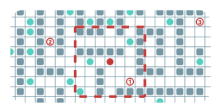
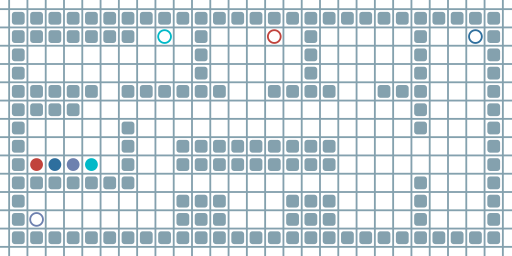

# Job Shop Scheduling from Language: A Heuristic-based Framework with Large Language Models

> Team 5  
> Yujin Kim (2024321236), Yonghwa Seo (2025311450)

---

##  Project Overview

This project presents a novel framework that tackles the **Job Shop Scheduling Problem (JSSP)** using **Large Language Models (LLMs)**. By interpreting human language descriptions and combining them with environment information, the system generates optimized job schedules using a suite of heuristic algorithms.

---

##  Problem Statement

The **Job Shop Scheduling Problem (JSSP)** is a classic optimization task where:

- Multiple jobs must be processed through a set of machines.
- Each job consists of a sequence of operations with defined order.
- Each machine can process only one operation at a time.
- Different jobs may need the same machines, leading to conflicts.

Additionally, this project incorporates **agent movement time** and **collision avoidance** to reflect real-world robotic shop floors.

<br/>

<p align="center">

</p>


---

##  Method

###  LLM-Based Pipeline

This project is structured to accept **natural language job descriptions as input** and produce **natural language responses as output**, enabling seamless interaction between human-readable tasks and scheduling solutions.
<p align="center">

</p>

<br/>

---
### 1. LLM1 (From Language to Matrix)

LLM1 is designed to convert natural language prompts into structured job matrices. Its input is a natural language job description (prompt), and the output is a JSON object containing both the matrix representation of the job schedule and associated label information (such as the best solver criterion). <br/>
The 'Mistral-7B-Instruct-v0.2' model was trained on a dataset of 5000 synthetically generated samples, which include randomly varied numbers of jobs and operations, different machine assignments, and diverse processing durations.
<p align="center">

</p>

- **Input**
```json
{
  "instruction": "Convert the following job description into a matrix. Each row is a job. Each tuple is (machine_index, duration). Also, return the correct label based on the evaluation criterion. Output must be in JSON format with keys 'matrix' and 'label'.",
  "evaluation_criterion": "Choose the solution generated by the solver that achieved the shortest makespan among all given solvers.",
  "job_descriptions": [
    "Job 1: M3 for 2; then M1 for 3; then M4 for 4",
    "Job 2: M2 for 4; then M3 for 2"
  ]
}
```
- **Output**
```json
{
  "matrix": [[[2, 2], [0, 3], [3, 4]],
             [[1, 4], [2, 2]]],
  "label": "best_makespan"
}
```
<br/>

---

### 2. Heuristic Solver Module
The heuristic solver module runs a suite of 6 heuristic solvers—including **Tabu Search, Genetic Algorithm (GA), Simulated Annealing (SA), OR-Tools, GRASP, and Ant Colony Optimization (ACO)**—on the matrix-form schedule generated by LLM1. Each solver proposes a solution, and the optimizer evaluates these results based on either the total makespan or the solver’s computation time, depending on the selected criterion.

Additionally, a special design is applied to incorporate movement time between machines. Pseudo-operations representing these movement intervals are added on LLM1's output. The movement time is calculated as the shortest path on a grid map derived from a user-provided environment image (PNG). This grid map assumes that each grid cell takes 1 second to traverse. To prevent conflicts between machines and movement placeholders, each pseudo-operation is assigned a machine index using the rule **"9 + job number + n-th movement"** so that they are distinct and non-overlapping.

- **Input**
```json
{
  "matrix": [[[900, 21], [2, 2], [901, 26], [0, 3], [902, 31], [3, 4]],
             [[910, 34], [1, 4], [911, 25], [2, 2]]],
  "label": "best_makespan"
}
```
- **Output**
```python
{
  "selected_solver": "tabu",
  "solution": {"schedule": [[(900, 0, 21), (2, 21, 23), (901, 23, 49), (0, 49, 52), (902, 52, 83), (3, 83, 87)],
                            [(910, 0, 34), (1, 34, 38), (911, 38, 63), (2, 63, 65)]],
               "makespan": 87}
}
```

<br/>

---

### 3. LLM2 (From Matrix to Language)

LLM2 is responsible for transforming the optimized job schedule, which is represented in matrix format, back into a human-readable natural language explanation. It takes as input the JSON-format schedule matrix generated by the selected solver and produces a textual summary of the job execution plan. 'Mistral-7B-Instruct-v0.2' model was trained on a dataset of 1000 samples, each pairing a schedule matrix with a fixed-structure natural language description.

- **Input**
```json
{
  "Convert the following job schedule into natural language:"
  {
  "selected_solver": "tabu",
  "solution": {"schedule": [[[900, 0, 21], [2, 21, 23], [901, 23, 49], [0, 49, 52], [902, 52, 83], [3, 83, 87]],
                            [[910, 0, 34], [1, 34, 38], [911, 38, 63], [2, 63, 65]]],
               "makespan": 87}
  }
  "Answer:"
}
```

- **Output (Final answer with simple parsing)**
```json
"Job 1 is processed on machine 3 from 21 to 23, machine 1 from 49 to 52, machine 4 from 83 to 87."
"Job 2 is processed on machine 2 from 34 to 38, machine 3 from 63 to 65. The total makespan is 87."
```

<br/>

---

###  4. Simulation 
#### Baseline Policy : Lifelong Multi-Agent Pathfinding Policy
This project provides a simulation framework for analyzing the interplay between job scheduling and multi-agent pathfinding, highlighting the challenges of schedule fidelity in dynamic, congested environments.

#### i. License
This project is licensed under the MIT License. Some portions of the code are adapted from [AIRI-Institute/learn-to-follow](https://github.com/AIRI-Institute/learn-to-follow) under the same license. See the [LICENSE](.learn_follow/LICENSE) file for details.

<p align="center">
  
</p>


#### ii. Policy Description

The core policy implemented in this project is based on the **Follower** algorithm proposed in  
["Learn to Follow: Decentralized Lifelong Multi-agent Pathfinding via Planning and Learning"](https://arxiv.org/pdf/2310.01207).


#### iii. Illustration
The figure above visualizes a typical lifelong multi-agent scenario.  
- Each circle represents an agent's goal.  
- The red area shows the local observation used by the RL policy.  
- Agents must coordinate their motion to achieve all goals efficiently, avoiding obstacles and each other in real-time.

For more details, see the original [paper](https://arxiv.org/pdf/2310.01207).


#### iv. Key features
- **Decentralized planning:**  
  Each agent plans its path independently using a global planner, then continually replans based on observed conflicts.
- **Lifelong pathfinding:**  
  Agents are repeatedly assigned new goals in a persistent, dynamic environment, requiring both reactivity and long-term strategy.
- **Local conflict resolution:**  
  A local reinforcement learning (RL) policy resolves collisions and deadlocks online, complementing the global planner.
- **Scalability and robustness:**  
  The combined global planning and local RL allow the system to handle large numbers of agents and complex, cluttered maps.


#### v. Detailed Modifications and Scope
- **Job Scheduling with Wait Times:** <br/>
In this simulation, each agent is given a fixed sequence of targets (jobs) to visit. Upon arriving at each target, the agent waits for a specified processing (wait) time, simulating job execution as in job-shop scheduling (JSSP). This setup allows for realistic modeling of both movement and task processing phases.

- **Simulation-Based Evaluation:** <br/>
This project does not introduce a new scheduling algorithm. Instead, it evaluates how well predefined job schedules and wait times are executed in a multi-agent environment that uses the decentralized “Follower” policy for pathfinding and conflict resolution.

- **Path and Schedule Consistency Analysis:** <br/>
The simulation records both the planned job sequences and the actual agent trajectories. By comparing the scheduled plans with the realized execution—including delays, waiting times, and conflicts—it quantifies the effects of path conflicts and congestion on overall task completion.

- **Motivation for Path-aware Scheduling:** <br/>
Discrepancies between scheduled and actual task completions observed in the simulation motivate further research into scheduling approaches that jointly consider movement, congestion, and task timing. This simulation serves as a baseline for such future work.

<br/>


---


## Installation:
We need create different python environments for 'solutions' and 'simulator'

#### 1-1. FOR SIMULATOR : Create environment, install packages, run the simulator
```
conda create -n mlp_jssp_sim python=3.8
conda activate mlp_jssp_sim
pip install -r sim/docker/requirements.txt
sim/test.py
```
#### 1-2. FOR SCHEDULE SOLUTIONS : Create environment, install packages, run the scheduler
```
conda create -n mlp_jssp_scheduler python=3.9
conda activate mlp_jssp_scheduler
pip install torch
pip install git+https://github.com/huggingface/peft.git@main
pip install ortools
pip install opencv-python
main.py
```
#### 2. Where to store input data
Job description prompts and map image is stored at `input/problem_prompt.json` and `input/env_img.png`.
For the simulator, the map configuration file is stored at `env/test-mapz.yaml` or you can specify the map file by editing the parser argument in your code:

```python
parser.add_argument('--map_name', type=str, default='mlp_test', help='Map name (default: %(default)s)')
```

#### 3-1. Setting goal sequences & wait sequences in simulator

Edit the goal sequences and wait sequences in our simulator specifically in the `create_custom_env()` function from `sim/test.py`. <br/>
- **goal_sequences**   : The list of goals (targets) each agent will visit in order. <br/>
- **wait_sequences**   : The wait time at each corresponding goal for each agent. <br/>
- **agents_start_pos** : The starting positions for each agent. <br/>

```python
goal_sequences = [
    [(0, 13), (0, 7), (0, 18), (10, 12), (0, 24)],
    [(0, 24), (0, 13), (10, 0)],
    [(10, 0), (0, 18), (10, 12)],
    [(0, 7), (10, 24), (0, 24), (0, 18)],
]

wait_sequences = [
    [10, 5, 20, 2, 12],
    [15, 7, 20],
    [10, 15, 20],
    [20, 5, 2, 10],
]

agents_start_pos = [(7, 0), (7, 1), (7, 2), (7, 3)]
```
#### 3-2. Setting config information to user condition in scheduler
Edit the directory path and hugging face token in `config.py`.
To check your Hugging Face token click [HERE](https://huggingface.co/settings/tokens).
```
# only thing you have to modify #

to_project_path          = "path_to_project_folder"     
which_prompt_do_you_want = "file_name_of_problem_prompt.json"             # no need to include path. only file name       
which_env_do_you_want    = "file_name_of_env_img.png"                     # no need to include path. only file name
HF_TOKEN                 = "your Hugging Face token with the access permission to mistralai/Mistral-7B-Instruct-v0.2"                  

```

#### 4. How to get trained models
Unable to upload models due to file size limitations.  
Please download the `model_mlp_team5` folder from the following [Google Drive link](https://drive.google.com/file/d/1b7WT1OgI_ctgezGKczuZKmmhotS3lc3m/view?usp=sharing) <br/>
The folder must contain 5 folders: <br/>
**>> llm1_jssp_mistral7b_lora_final , llm2_mistral7b-lora-struct2text , model**

After downloading, place the folders with the following directory structure:
```
.
├── input/
├── train_llm/
├── llm1_jssp_mistral7b_lora_final/
├── llm2_mistral7b-lora-struct2text/
└── sim/
    :
    ├── learn_follow/
    ├── model/
    ├── pogema/
    :
```
<br/>

---

##  Results 

### 1. LLM Conversion Accuracy
We went through a brief benchmark comparing conversion performance between the LLM fine-tuned with our dataset, original Mistral model before fine-tuned and a simple sequence-to-sequence model.
Each model was evaluated by a test dataset with 50 samples. <br/>
**"EM Acc"** shows how many samples each model exactly matched the ground truth, **"Format Fail"** shows how many samples had failed to get the correct format, and **"Avg Inference Time"** represents how long it took to generate samples. <br/>
Due to the nature of the task, even minor errors in the output render it unusable, so partial credit metrics were not employed.


<p align="center">
  
  
</p>

<div align="center">
  Fig. Train loss of LLM1 (left) and LLM2 (right)
</div>

<br/>

#### i. Performance of LLM1 (convert human language to matrix)
> **"Matrix Only"** and **"Label Only"** represents the percentage of matrix or label answers with the correct format 
<p align="center">

</p>

#### ii. Performance of LLM2 (convert matrix to human language)
<p align="center">

</p>

<br/>

### 2. Evaluation of Heuristic Solver Module
The plausibility and feasibility of the solutions generated by the heuristic solver module were verified through our simulation.

**- Example of solution:**
```
{
  'selected_solver': 'ortools', 
  'solution': {'schedule': [
                [(900, 0, 21), (2, 21, 31), (901, 31, 51), (0, 51, 56), (902, 56, 81), (3, 81, 101), (903, 101, 117), (5, 117, 119), (904, 119, 141), (1, 141, 153)], 
                [(910, 0, 34), (1, 34, 49), (911, 49, 74), (2, 74, 81), (912, 81, 104), (6, 104, 124)], 
                [(920, 0, 19), (6, 19, 29), (921, 29, 52), (2, 52, 67), (922, 67, 88), (5, 88, 108)], 
                [(930, 0, 11), (0, 11, 31), (931, 31, 64), (4, 64, 69), (932, 69, 79), (1, 79, 81), (933, 81, 99), (3, 122, 132)]
                ],
  'makespan': 153}
}
```

<p align="center">
  
</p>

---

## Discussions
- **Scalability & Applicability**<br/>
The JSSP (Job Shop Scheduling Problem) framework and simulation-based solver architecture proposed in this study offer a wide range of scalability and potential for further advancement.

- **Diverse Dataset and Naturalistic Description Handling**<br/>
While the current system mainly uses structured job descriptions as inputs, it can be expanded to accept more natural and free-form expressions, such as real-time speech data converted to text or conversational instructions. This broadens the system’s applicability to more realistic and complex scheduling problems and increases its value in real-world environments through integration with LLM-based natural language processing technologies.

- **Modular and Extensible Solver Architecture**<br/>
Owing to its simple yet robust structure, the framework allows for flexible integration of various optimization solvers and path planning algorithms. This enables not only job sequence generation, but also detailed scheduling that considers agent role transitions, spatial movement at each step, and task duration. Furthermore, the platform can be extended to research advanced algorithms for multi-agent collision avoidance and real-time dynamic scheduling, all validated through simulation.

- **Algorithm Recommendation & User-Friendly Framework**<br/>
The ultimate goal is to provide an end-to-end framework that enables users to solve complex scheduling problems easily, even without expert knowledge. By simply entering intuitive instructions or keywords, the system can automatically recommend and apply the most suitable scheduling algorithms and generate feasible paths.

- **Applicability to Other Domains**<br/>
With simple modification of solvers or datasets, the framework can be readily adapted to various industrial fields, robot control, automation systems, and more. This demonstrates its potential as a customizable optimization solution, which will be further verified through experiments and practical deployments.

## Future Work
- **Real-Time Interaction and Adaptive Learning**<br/>
Future work includes the development of a real-time, interactive feedback system. For example, when exceptional events such as machine failure or worker absence occur in the field, operators could input additional information in natural language. The LLM will immediately reflect these changes, reconstruct the schedule, and provide updated simulation results—realizing an adaptive scheduling system.

- **Reinforcement Learning & Self-Adaptive Optimization**<br/>
Beyond LLMs, reinforcement learning (RL)-based self-adaptive schedulers can be incorporated. By repeatedly training on simulation data, the system can learn and refine optimal scheduling policies for given environments, resulting in more robust and adaptive schedulers against unexpected changes.

- **Multi-Agent Collaboration & Competition Scenarios**<br/>
The framework can be extended to sophisticated multi-agent scenarios involving collaboration, competition, and varying degrees of autonomy. In large-scale production lines, logistics centers, or heterogeneous robot environments, the system can manage dynamic role assignments, cooperative/competitive decision-making, and other complex agent interactions.

<br/>

---
## Contribution of each team member
All topic selection, literature review, and algorithm structure design were carried out through discussions between the two team members. During the main development phase, Yujin Kim primarily worked on LLM training and the solver pipeline implementation, and Yonghwa Seo mainly worked on building and operating the simulator. The creation of the GitHub repository and README were completed collaboratively.
